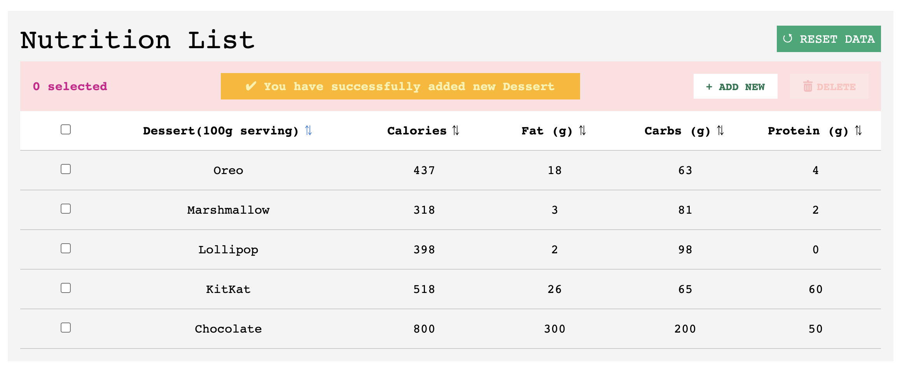

# Nutrition Chart

# The goal of this exercise is to build a “Nutrition Table” user interface using below tech stack.
1. React
2. TypeScript
3. Tachyons (CSS)
4. React-Query 
5. Jest (Unit and Integration Testing Library)
6. TestCafe (Functional Testing Library)
7. GraphQL (Apollo-express server)
---

## Start app server

Run `yarn start` to run the app in the development mode. 
Open [http://localhost:3000](http://localhost:3000) to view it in the browser.

The page will reload if you make edits. 
You will also see any lint errors in the console.

## Start graphql server

Run `yarn server` to execute bring up apollo-express graphql server in watch mode.  
Open [http://localhost:3600/graphql](http://localhost:3600/graphql) to view graphql playground or to connect to server.

### Running unit tests

Run `yarn test` to execute the unit tests via [Jest](https://jestjs.io).

### Running end-to-end tests

Run `yarn e2e ` to execute the end-to-end tests via [Test Cafe ](https://devexpress.github.io/testcafe/).

## Please refer to the Best Practices for Typescript:

https://confluence.walmart.com/display/~s0s05pn/Typescript+Best+Practices
